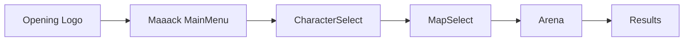

# Maaack Menu Plugin - Usage Guide

**Created:** 2025-10-01
**Status:** Active Integration
**Plugin Version:** Maaack's Godot Menus Template

## 📚 Table of Contents

1. [Plugin Overview](#plugin-overview)
2. [What's Already Set Up](#whats-already-set-up)
3. [How to Customize](#how-to-customize)
4. [Menu Flow Integration](#menu-flow-integration)
5. [Audio Configuration](#audio-configuration)
6. [Settings System](#settings-system)
7. [Adding Pause Menu](#adding-pause-menu)
8. [Troubleshooting](#troubleshooting)

---

## Plugin Overview

### Architecture Pattern

The plugin uses a **Base + Examples** pattern:

```
addons/maaacks_menus_template/     ← BASE CLASSES (never edit)
  └── base/
      ├── scenes/
      │   ├── menus/main_menu/main_menu.tscn
      │   ├── overlaid_menus/pause_menu.tscn
      │   └── options_menu/master_options_menu.tscn
      └── scripts/
          └── [base class scripts]

scenes/ui_v2/                      ← YOUR CUSTOMIZABLE EXAMPLES
  └── scenes/
      ├── menus/main_menu/main_menu.tscn    ← Customize this!
      ├── overlaid_menus/pause_menu.tscn    ← Customize this!
      └── options_menu/master_options_menu.tscn ← Customize this!
```

**DO:**
✅ Edit scenes in `scenes/ui_v2/` directly
✅ Override functions in your scripts
✅ Add custom nodes to scenes
✅ Change appearance, colors, fonts

**DON'T:**
❌ Edit anything in `addons/maaacks_menus_template/`
❌ Create "inherited scenes" from base (examples already do this)
❌ Delete base autoloads

---

## What's Already Set Up

### New Autoloads (coexist with your existing ones)

| Autoload | Purpose | When to Use |
|----------|---------|-------------|
| `SceneLoader` | Async scene loading + progress bar | Replace all `get_tree().change_scene_to_file()` |
| `AppConfig` | Settings persistence (user://config.cfg) | Save/load audio, video, control settings |
| `ProjectMusicController` | Background music management | Play music tracks with crossfading |
| `ProjectUISoundController` | Button click sounds | Automatic button sound attachment |

### Current Main Scene

```gdscript
# project.godot
run/main_scene="res://scenes/ui_v2/scenes/opening/opening_with_logo.tscn"
```

**Boot Flow:**
1. Opening logo animation
2. Main menu (with Options, Credits, Quit buttons)
3. **New Game button** → overridden to go to CharacterSelect

### Customized Scenes

**`scenes/ui_v2/scenes/menus/main_menu/main_menu.gd`:**
```gdscript
extends MainMenu

func new_game() -> void:
    # Override base behavior to go to character select
    SceneLoader.load_scene("res://scenes/ui/CharacterSelect.tscn")
```

---

## How to Customize

### 1. Customize Main Menu Appearance

**Open:** `scenes/ui_v2/scenes/menus/main_menu/main_menu.tscn` in Godot Editor

**What You Can Change:**
- Title/subtitle text (`TitleLabel`, `SubTitleLabel`)
- Button labels (`NewGameButton`, `OptionsButton`, etc.)
- Background image (`BackgroundTextureRect`)
- Colors, fonts, margins
- Add logo (add `TextureRect` node)

**Example - Add Logo:**
1. Select `MenuContainer` node
2. Add child node → `TextureRect`
3. Set texture to your logo
4. Position above title

### 2. Customize Button Behavior

**Current Buttons:**
- **New Game** → Goes to CharacterSelect (customized)
- **Options** → Opens options menu (built-in)
- **Credits** → Opens credits (built-in)
- **Exit** → Quits game (built-in)

**To Override Other Buttons:**
```gdscript
# In scenes/ui_v2/scenes/menus/main_menu/main_menu.gd

func _ready() -> void:
    super._ready()

    # Add custom button handler
    var custom_button = get_node("%CustomButton")
    custom_button.pressed.connect(_on_custom_pressed)

func _on_custom_pressed() -> void:
    SceneLoader.load_scene("res://scenes/ui/CustomScene.tscn")
```

### 3. Scene Transitions with SceneLoader

**Replace all manual scene loading:**

```gdscript
# ❌ OLD WAY (no loading screen)
get_tree().change_scene_to_file("res://scenes/arena/Arena.tscn")

# ✅ NEW WAY (with loading screen)
SceneLoader.load_scene("res://scenes/arena/Arena.tscn")

# Optional: Show loading screen with signal
SceneLoader.load_scene("res://scenes/arena/Arena.tscn", true)
```

**Where to Update:**
- `scenes/ui/MainMenu.gd` → `_on_start_run_pressed()` (already done)
- `autoload/StateManager.gd` → Any scene transitions
- Any UI scripts that load scenes

---

## Menu Flow Integration

### Current Flow



### Target Flow

```
Opening Logo → Main Menu (Maaack) → [Your existing flow]
                   ↓ Options
                   ↓ Credits
                   ↓ Quit
```

### Integration Points

**1. CharacterSelect Scene (`scenes/ui/CharacterSelect.tscn`)**
- Already integrated! Main menu's "New Game" button goes here
- No changes needed

**2. MapSelect Scene (`scenes/ui/MapSelect.tscn`)**
- Continue using existing flow
- CharacterSelect → MapSelect → Arena

**3. Results Screen**
- After arena death, return to Main Menu:
```gdscript
# In your results screen
func _on_return_to_menu_pressed() -> void:
    SceneLoader.load_scene("res://scenes/ui_v2/scenes/menus/main_menu/main_menu.tscn")
```

---

## Audio Configuration

### Background Music

**Add music to Main Menu:**

1. **Add music file to project:**
```bash
assets/audio/music/menu_theme.ogg
```

2. **Open `scenes/ui_v2/scenes/menus/main_menu/main_menu.tscn`**

3. **Find `BackgroundMusicPlayer` node**

4. **Set stream:**
- Inspector → Stream → Load `assets/audio/music/menu_theme.ogg`
- Autoplay: `true`
- Bus: `Music`

**Control music from code:**
```gdscript
# Play/stop music
ProjectMusicController.play_music(music_stream)
ProjectMusicController.stop_music()

# Crossfade between tracks
ProjectMusicController.crossfade_to(new_music_stream, 2.0)  # 2 second fade
```

### UI Button Sounds

**Automatic Button Sounds:**
The `ProjectUISoundController` automatically adds click sounds to ALL buttons via `node_added` signal.

**Custom button sounds:**
```gdscript
# In your button script
func _ready() -> void:
    pressed.connect(_play_custom_sound)

func _play_custom_sound() -> void:
    var sound = load("res://assets/audio/sfx/custom_click.ogg")
    ProjectUISoundController.play_ui_sound(sound)
```

**Disable auto-sounds for specific buttons:**
```gdscript
# Add to button's script class_name metadata
@export var disable_ui_sounds: bool = true
```

### Audio Bus Setup

The plugin created `default_bus_layout.tres` with:
- **Master** bus
- **Music** bus (child of Master)

**To add more buses:**
1. Audio → Audio Bus Editor
2. Add bus: SFX, UI, Ambience
3. Save layout

---

## Settings System

### Built-in Options Menu

**Already included:** `scenes/ui_v2/scenes/menus/options_menu/master_options_menu.tscn`

**Features:**
- Audio sliders (Master, Music, SFX)
- Video settings (fullscreen, vsync, resolution)
- Input remapping
- Settings persistence to `user://config.cfg`

**To customize options:**
1. Open `master_options_menu.tscn`
2. Add custom setting controls
3. Use `AppConfig` to save/load:

```gdscript
# Save custom setting
AppConfig.set_config("gameplay", "difficulty", "hard")

# Load custom setting
var difficulty = AppConfig.get_config("gameplay", "difficulty", "normal")
```

### Config File Location

```bash
Windows: %APPDATA%/Godot/app_userdata/Vibe/config.cfg
Linux: ~/.local/share/godot/app_userdata/Vibe/config.cfg
Mac: ~/Library/Application Support/Godot/app_userdata/Vibe/config.cfg
```

---

## Adding Pause Menu

### To Arena Scene

**1. Open `scenes/arena/Arena.tscn`**

**2. Instantiate Pause Menu:**
- Right-click Arena root
- Instantiate Child Scene
- Select: `scenes/ui_v2/scenes/overlaid_menus/pause_menu.tscn`

**3. Set to Top Layer:**
- Select PauseMenu node
- CanvasLayer → Layer: `100` (above HUD)

**4. Connect to Arena Script:**
```gdscript
# In Arena.gd
@onready var pause_menu = $PauseMenu

func _ready() -> void:
    # Pause menu auto-handles ESC key
    pause_menu.resume_pressed.connect(_on_resume_game)
    pause_menu.quit_pressed.connect(_on_quit_to_menu)

func _on_resume_game() -> void:
    # Resume game logic
    pass

func _on_quit_to_menu() -> void:
    SceneLoader.load_scene("res://scenes/ui_v2/scenes/menus/main_menu/main_menu.tscn")
```

**5. Integrate with PauseManager:**
```gdscript
# In Arena.gd or PauseManager.gd
func _input(event: InputEvent) -> void:
    if event.is_action_pressed("ui_cancel"):
        if PauseManager.is_paused():
            PauseManager.unpause()
            pause_menu.hide()
        else:
            PauseManager.pause()
            pause_menu.show()
```

### Pause Menu Customization

**Open:** `scenes/ui_v2/scenes/overlaid_menus/pause_menu.tscn`

**Customize:**
- Title text
- Button labels (Resume, Options, Quit)
- Background color/opacity
- Add custom buttons

---

## Troubleshooting

### Issue: Opening Logo Skips Too Fast

**Fix:** Edit `scenes/ui_v2/scenes/opening/opening_with_logo.tscn`
- Adjust animation duration
- Add `Timer` node for minimum display time

### Issue: No Loading Screen Appears

**Check:**
- Using `SceneLoader.load_scene()` (not `get_tree().change_scene_to_file()`)
- Scene is large enough to trigger loading screen (small scenes load instantly)

**Force loading screen:**
```gdscript
SceneLoader.load_scene("res://scenes/arena/Arena.tscn", true)  # true = show loading screen
```

### Issue: Button Sounds Not Playing

**Check:**
1. Audio bus "Music" exists (Audio Bus Editor)
2. `ProjectUISoundController` autoload is enabled
3. Audio files exist in plugin assets

**Test:**
```gdscript
# In any scene
func _ready() -> void:
    var test_sound = load("res://addons/maaacks_menus_template/base/assets/audio/button_click.ogg")
    if test_sound:
        print("Sound loaded!")
    else:
        print("Sound missing!")
```

### Issue: Settings Not Persisting

**Check:**
1. `AppConfig` autoload is enabled
2. Write permissions to user:// folder
3. Config file exists:
```gdscript
print(OS.get_user_data_dir())  # Print config location
```

### Issue: Pause Menu Doesn't Pause Game

**Ensure PauseManager integration:**
```gdscript
# In pause_menu.gd (override)
func _on_resume_button_pressed() -> void:
    super._on_resume_button_pressed()
    PauseManager.unpause()  # Your existing pause system

func _on_pause_activated() -> void:
    PauseManager.pause()  # Your existing pause system
```

---

## Next Steps

1. ✅ Cleanup obsolete custom templates (DONE)
2. ✅ Connect Main Menu to CharacterSelect (DONE)
3. ⏳ Add PauseMenu to Arena scene
4. ⏳ Configure background music
5. ⏳ Test complete menu flow

---

## See Also

- [Maaack Plugin Documentation](https://github.com/Maaack/Godot-Menus-Template)
- [Integration Guide](MAAACK_MENU_INTEGRATION_GUIDE.md)
- [Project CLAUDE.md](../../CLAUDE.md)
