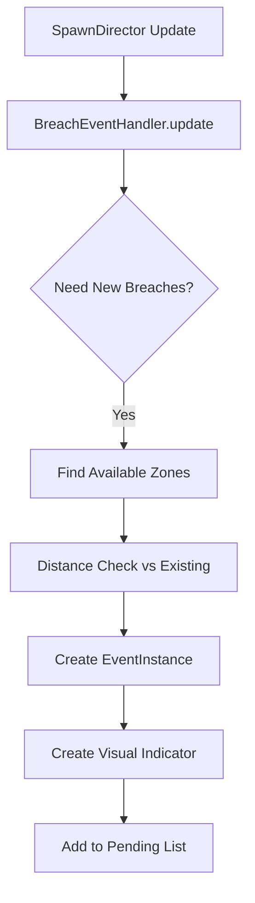
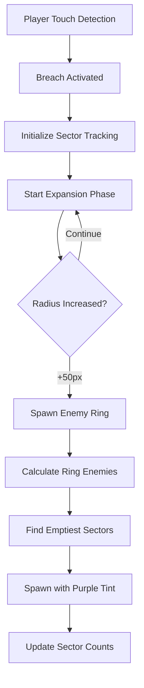
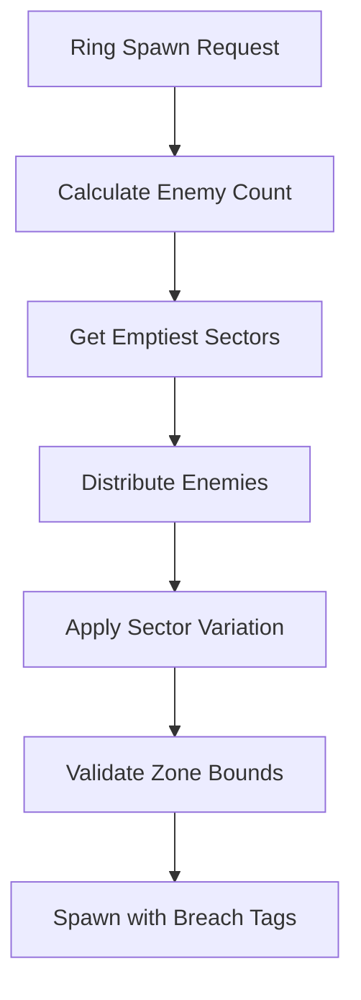
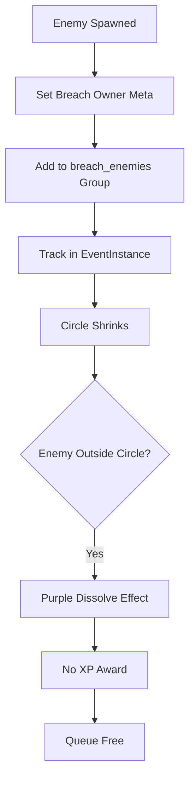

# Breach Event System Architecture
*Path of Exile Atlas-style dynamic event system with independent multi-breach support*

**Status:** ✅ Production Ready | **Version:** v2.0 (Dynamic Ring Spawning)
**Last Updated:** 2025-09-20 | **Integration:** EventBus + SpawnDirector

---

## System Overview

The Breach Event System implements PoE-Atlas-style dynamic events featuring expanding circles that spawn enemies in controlled patterns. Multiple breaches can operate simultaneously without interference, each managing their own enemy pools and lifecycle phases.

### Key Features
- **Dynamic Ring Spawning**: Enemies spawn in rings as circles expand
- **Sector-Based Distribution**: 16-sector system ensures even enemy placement
- **Independent Multi-Breach**: Up to 3 simultaneous breaches with no cross-interference
- **Hot-Reloadable Configuration**: Resource-based tuning via `.tres` files
- **Deterministic Lifecycle**: WAITING → EXPANDING → SHRINKING → COMPLETED phases

---

## Architecture Components

### Core Classes

#### 1. BreachEventHandler.gd
**Location:** `scripts/systems/events/BreachEventHandler.gd`
**Role:** Main coordinator for all breach event logic

```gdscript
# Key Responsibilities:
- Breach creation in available spawn zones
- Player activation detection (touch-based)
- Dynamic ring spawning during expansion
- Enemy cleanup during shrinking phase
- Visual indicator management (scene-based)
```

**Integration Pattern:**
```gdscript
# Called by SpawnDirector every frame
func update(dt: float) -> void:
    _handle_breach_creation()    # Create pending breaches
    _check_breach_activation()   # Touch detection
    _update_active_breaches(dt)  # Lifecycle management
    _cleanup_completed_breaches() # Award mastery points
```

#### 2. EventInstance.gd
**Location:** `scripts/systems/EventInstance.gd`
**Role:** Individual breach state management and lifecycle tracking

```gdscript
# Lifecycle Phases:
enum Phase { WAITING, EXPANDING, SHRINKING, COMPLETED }

# Dynamic Ring System:
var last_ring_spawn_radius: float = 0.0
var ring_spawn_threshold: float = 50.0  # New ring every 50px
var sector_enemy_counts: Dictionary = {} # Distribution tracking
```

#### 3. BreachEventConfig.gd
**Location:** `scripts/resources/BreachEventConfig.gd`
**Role:** Hot-reloadable configuration resource

```gdscript
# Key Parameters:
@export var expand_duration: float = 10.0
@export var max_radius: float = 150.0
@export var ring_spawn_interval: float = 50.0
@export var enemy_density: float = 0.033  # ~1 enemy per 30px circumference
@export var sector_count: int = 16
```

---

## System Flow & Integration

### 1. Breach Creation Flow


**Zone Independence Pattern:**
```gdscript
# CHANGED: Only distance-based validation (no zone cooldowns)
func _is_zone_far_from_existing_breaches(zone_area) -> bool:
    var min_distance = breach_config.min_breach_distance  # 200px default
    for existing_breach in all_breaches:
        if zone_center.distance_to(existing_breach.center_position) < min_distance:
            return false
    return true
```

### 2. Player Activation & Ring Spawning


**Dynamic Ring Calculation:**
```gdscript
func _calculate_ring_enemy_count(radius: float) -> int:
    var circumference = 2 * PI * radius
    var edge_circumference = circumference * edge_spawn_factor  # 87% of radius
    return max(3, int(edge_circumference * enemy_density))     # ~1 per 30px
```

### 3. Sector-Based Enemy Distribution


**Sector Management:**
```gdscript
func get_emptiest_sectors(count: int) -> Array[int]:
    # Sort sectors by enemy count (ascending)
    sector_data.sort_custom(func(a, b): return a["count"] < b["count"])
    return first_N_sector_ids
```

### 4. Enemy Ownership & Cleanup


**Ownership Tracking:**
```gdscript
# IMMEDIATE tagging prevents race conditions
enemy_node.set_meta("breach_owner", breach_event.breach_id)
enemy_node.set_meta("breach_spawned", true)
enemy_node.add_to_group("breach_enemies")

# Cleanup validation
func _is_enemy_owned_by_breach(enemy_node, breach_id) -> bool:
    return enemy_node.get_meta("breach_owner") == breach_id
```

---

## EventBus Integration

### Signal Contracts
```gdscript
# EventBus emissions from BreachEventHandler:
EventBus.event_started.emit("breach", breach_event.zone)
EventBus.event_completed.emit("breach", performance_data)

# Performance data structure:
{
    "duration": breach_event.get_total_duration(),
    "enemies_spawned": breach_event.spawned_enemies.size(),
    "zone": breach_event.zone.name,
    "completion_time": Time.get_time_dict_from_system()
}
```

### SpawnDirector Coordination
```gdscript
# BreachEventHandler depends on SpawnDirector for:
- Arena scene access: spawn_director._get_arena_scene()
- Enemy spawning: spawn_director._spawn_from_config_v2()
- Zone validation: arena_scene._spawn_zone_areas
- Alive enemy tracking: spawn_director.get_alive_enemies()
```

---

## Configuration & Hot-Reload

### Resource-Driven Design
**File:** `data/balance/breach_event_config.tres`
```tres
[gd_resource type="BreachEventConfig"]
[resource]
expand_duration = 10.0
shrink_duration = 10.0
max_radius = 150.0
ring_spawn_interval = 50.0
enemy_density = 0.033
enemy_modulate = Color(0.8, 0.3, 1.0, 0.9)
min_breach_distance = 200.0
max_simultaneous_breaches = 3
```

**Hot-Reload Pattern:**
```gdscript
# Force reload on every initialization for live tuning
breach_config = ResourceLoader.load(
    "res://data/balance/breach_event_config.tres",
    "",
    ResourceLoader.CACHE_MODE_IGNORE
)
```

### Visual Indicator System
**Scene-Based Approach:**
```gdscript
# Loads BreachIndicator.tscn for editor-friendly customization
var breach_scene = load("res://scenes/events/BreachIndicator.tscn")
var breach_indicator = breach_scene.instantiate()

# Fallback to programmatic creation if scene missing
if not ResourceLoader.exists(breach_scene_path):
    _create_simple_breach_indicator(breach_event)
```

---

## Performance Optimizations

### Spatial Validation
```gdscript
# Zone bounds checking with shape-aware collision
func _is_position_in_zone(position: Vector2, zone_area: Area2D) -> bool:
    if shape is RectangleShape2D:
        return abs(local_pos.x) <= half_size.x and abs(local_pos.y) <= half_size.y
    elif shape is CircleShape2D:
        return local_pos.length() <= circle_shape.radius
```

### Ring Spawn Optimization
```gdscript
# Only spawn when expansion crosses threshold
func should_spawn_new_ring() -> bool:
    return (phase == Phase.EXPANDING and
            current_radius - last_ring_spawn_radius >= ring_spawn_threshold)
```

### Enemy Cleanup During Shrinking
```gdscript
# Efficient distance-based cleanup
for enemy in arena_root.get_children():
    if enemy.is_in_group("breach_enemies"):
        var distance = enemy.global_position.distance_to(breach_event.center_position)
        if distance > breach_event.current_radius:
            _delete_breach_enemy_with_effect(enemy)
```

---

## Testing & Validation

### Headless Test Coverage
**Location:** `tests/` (planned)
```gdscript
# Suggested test scenarios:
- Multi-breach independence (no cross-interference)
- Sector distribution validation (even enemy spread)
- Resource configuration hot-reload
- Enemy ownership tracking accuracy
- Performance with 3 simultaneous breaches
```

### Debug Logging Categories
```gdscript
Logger.debug("Ring spawning: %d enemies in sectors %s" % [count, sectors], "events")
Logger.info("Breach activated by player at %s" % [position], "events")
Logger.warn("Failed to load valid breach config", "events")
```

---

## Integration with Other Systems

### EventMasterySystem
```gdscript
# Placeholder integration for breach-specific passives:
func _apply_breach_modifiers(breach_event: EventInstance) -> void:
    var event_def = mastery_system.get_event_definition("breach")
    var modified_config = mastery_system.apply_event_modifiers(event_def)
    # TODO: Apply duration/size/spawn rate modifiers
```

### Enemy Factory Integration
```gdscript
# Uses EnemyFactory for consistent spawn behavior
var spawn_context = {
    "run_id": RunManager.run_seed,
    "context_tags": ["event", "breach", "ring_spawn"],
    "spawn_type": "breach_ring",
    "event_type": "breach"
}
var cfg = EnemyFactoryScript.spawn_from_weights(spawn_context)
```

### Visual Effects System
```gdscript
# Purple modulation for breach identity
cfg.modulate = breach_config.enemy_modulate  # Color(0.8, 0.3, 1.0, 0.9)

# Dissolve effect on cleanup (no XP reward)
tween.tween_property(enemy_node, "modulate", Color(0.8, 0.0, 1.0, 0.0), 0.5)
```

---

## Future Enhancement Opportunities

### Planned Features (from breach_summary.md)
1. **Monster Reveal System**: Spawn enemies invisible, reveal when circle reaches them
2. **Spawn Area Validation**: Polygon-based valid ground checking
3. **Specialized Breach Monsters**: Unique enemy types for event identity
4. **Event UI Overlay**: Counter, statistics, modifier display
5. **Multi-Breach Synergies**: Intersection effects and bonuses

### Architecture Extensions
- **EventSpawnStrategy.gd**: Base class for event-specific spawn patterns
- **Ritual/PackHunt Events**: Similar handler pattern for other event types
- **Dynamic Event Progression**: Non-linear expansion patterns
- **Map-Based Interaction**: Terrain effects within breach circles

---

## Migration & Maintenance Notes

### Breaking Changes from v1.0
- ❌ **Removed**: Zone cooldown system (multi-breach independence)
- ❌ **Removed**: Time-based spawning (replaced with radius-based rings)
- ❌ **Removed**: Legacy spawn strategy system
- ✅ **Added**: Sector-based enemy distribution
- ✅ **Added**: Dynamic ring spawning with configurable intervals
- ✅ **Added**: Breach-specific enemy ownership tracking

### Code Quality Standards
```gdscript
# ✓ Proper dependency injection via SpawnDirector
# ✓ Resource-driven configuration with validation
# ✓ EventBus communication with typed payloads
# ✓ Strategic logging with event category
# ✓ Hot-reload support for live tuning
# ✓ Scene-based visual indicators for editor workflow
```

---

## Related Documentation
- **[EventBus System](EventBus-System.md)**: Signal contracts and payload types
- **[Enemy System Architecture](Enemy-System-Architecture.md)**: Enemy spawning and lifecycle
- **[Spawn System Pattern](Spawn-System-Direct-Return-Pattern.md)**: Zone-based spawning guidelines
- **[Performance Optimization](Performance-Optimization-System.md)**: MultiMesh and spatial optimization

---

*This documentation reflects the current production implementation of the breach event system as of September 2025. For implementation details, see the source files in `scripts/systems/events/`.*